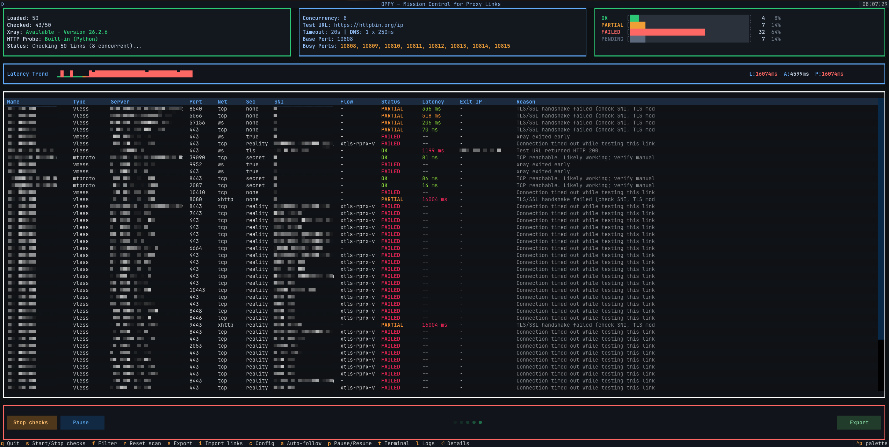

# OPPY - Mission Control for Proxy Links

<p align="center">
  
</p>

OPPY is a cross-platform, high-performance TUI for validating proxy links at scale, with concurrent checks, live status and latency telemetry, rich per-row diagnostics, filtering, and flexible export workflows.



Supported link types:

- `vless://...`
- `vmess://...`
- Telegram SOCKS (`https://t.me/socks?...`)
- Telegram MTProto (`https://t.me/proxy?...`, `tg://proxy?...`)
- DNS resolvers (`udp://ip[:port]`, `ip:port`)

## Requirements

- Python 3.10+
- `xray` installed and available in `PATH` (required for VLESS / VMESS checks)

---

## Install Xray

### macOS

Download the latest Xray release, extract `xray`, and put it in your `PATH`.
Then verify:

```bash
xray version
```

### Ubuntu / Debian (APT)

```bash
sudo apt update
sudo apt install -y xray-core
```

If `xray-core` is unavailable in your configured repositories, use the official install method from the Xray project and ensure `xray` is in `PATH`.

### Windows

1. Download Xray release zip from the official project.
2. Extract `xray.exe`.
3. Add its folder to `PATH` in System Environment Variables.
4. Open a new terminal and verify:

```powershell
xray version
```

---

## Install OPPY

### One-liner (Linux / macOS)

```bash
curl -fsSL https://raw.githubusercontent.com/f4rih/oppy/main/install.sh | bash
```

What this script does:

- installs `xray` on Linux when missing (apt first, then official installer fallback)
- installs OPPY with pip in user scope
- installs optional clipboard support (`pyperclip`)
- prints PATH hint if `oppy` command is not yet visible

### Manual setup (clone + requirements)

```bash
git clone https://github.com/f4rih/oppy.git
cd oppy
python3 -m venv .venv
source .venv/bin/activate
pip install -r requirements.txt
python oppy.py --input-file output.txt
```

### pip

From PyPI:

```bash
pip install oppy-mc
```

With optional clipboard support:

```bash
pip install "oppy-mc[clipboard]"
```

### uv

From PyPI:

```bash
uv pip install oppy-mc
```

Tool-style install:

```bash
uv tool install oppy-mc
```

---

## Run

With input file:

```bash
oppy --input-file output.txt
```

Without file (import in app with `i`):

```bash
oppy
```

CLI mode:

```bash
oppy --input-file output.txt --no-tui
```

## Terminal Rendering Note (macOS)

On macOS, the built-in Terminal app may render some borders/buttons with visual artifacts.
For a cleaner UI, prefer a modern third-party terminal such as Ghostty, iTerm2, or WezTerm.

---
## Highlights

- Multi-type checks in one table: VLESS, VMESS, Telegram SOCKS, MTProto, DNS.
- Live status meters + latency trend with running updates.
- Filter modal (`f`) for type/name/server and drop-matching records.
- Import modal (`i`) with paste/file tabs and clipboard load.
- Config modal (`c`) for concurrency, timeout, DNS retry settings, test URL, base port.
- Export modal (`e`) with type selection and optional partial export (green/orange only).
- Row details modal (`Enter`) with full payload and copy URL.

---

## Tutorial

See [TUTORIAL.md](TUTORIAL.md) for a step-by-step workflow.
